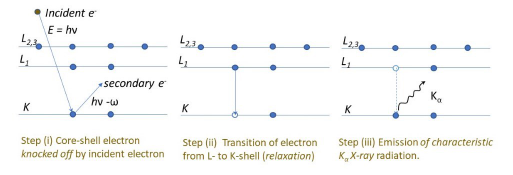
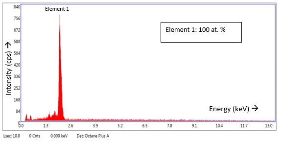
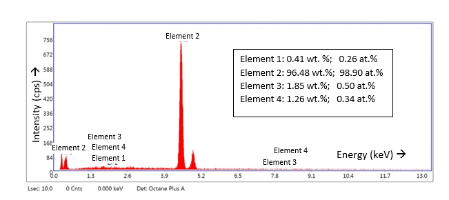
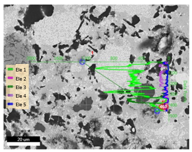
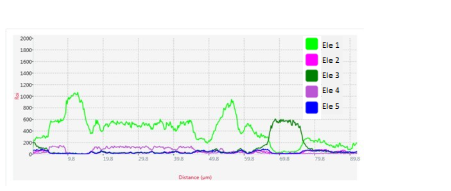
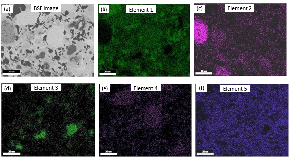

It was presented earlier that the incident beam electrons interact with matter and result characteristic x-rays (among other signals of Auger electrons, secondary electrons, and back-scattered electrons). These characteristic x-rays can be utilized to obtain the elemental information of the sample. We have already learned in the earlier experiments that back-scattered electron imaging provides a compositional contrast due to difference in the atomic number. In other words, the high back-scattering of electrons in BSE mode can provide us an indication of different phases in a material. But, that information is only qualitative in nature. Herein, the characteristic x-ray signal can be utilized to obtain <i><b>quantitative</b></i> information on content of each phase or location. The intensity of x-ray is proportional to the content of each element, which can be combined to provide information on presence of an element of a phase.  
 
<!-- 

<video width="320" height="240" controls>
  <source src="images/exp4-eds_img_req_mod.mp4" type="video/mp4">
  Your browser does not support the video tag.
</video> 
Video on Elemental mapping: Spot, Line and Area Analysis
 -->

<video width="320" height="240" controls>
  <source src="images/exp4-eds_img_req_mod.mp4" type="video/mp4">
  Your browser does not support the video tag.
</video> Video on Elemental mapping: Spot, Line and Area Analysis

X-ray is generated in three steps (Fig. 1), where in step (i) the incident electron beam of energy (E = hν) knocks out a core shell electron (K-shell in this case), then in step (ii) an electron from higher shell jumps to core-shell via relaxation process, and then in step (iii) the excess energy is released as x-ray, which is characteristic of that element (mapping to the transition of energy difference between energies of these shells). Hence, this characteristic energy can be utilized to identify the elements producing these x-ray radiations. Number of such event correlate with the amount of material present. Hence, the higher the content of material, higher the number of these events. And each element has different set of energy transitions from one shell to other, hence each element can be identified and quantified. Low atomic number elements are difficult to analyze due to their poor x-ray cross-section (or poor x-ray intensity).   
 
Figure 1: The three steps eliciting the generation of characteristic x-rays in an element  
Generically, the elemental signal is captured by the detector and then each element can be identified, and its content can also be quantified. For example, if a sample has 50 at.% Si and 50 at.% C, it could either be a composite containing these two elements separately or may be SiC compound. Thus, the elemental distribution does not directly provide the presence of individual elements or presence of a single phase. Nonetheless, some indication from BSE imaging can complement the information. If we observe similar brightness throughout the sample, then we may have a single phase only, whereas, if we observe two different brightness in BSE image, then we may expect presence of two different phases.  
<b>ZAF Correction:</b> 

Consider a scenario, where the microstructure possesses more than one element. Now each element has a different atomic cross-section due to different in their average atomic number (as the phase can be an element or a compound, or may have difference in density for combination of two or more elements). Hence, each phase will show a brightness with dependence on their average atomic number. Assume that phase 1 has a higher x-ray contrast compared to that of phase 2. And in this condition, if equal volume fraction of phase 1 and phase 2 is present in a microstructure, then the intensity of phase 1 will be much brighter than phase 2, though their volume content is same. This is called “atomic number contrast” or is adjusted by “<b><i>Z</i></b>” correction (or <b><i>Atomic Number</i></b> correction) to account for the same.  
Now, if more than one element is present in the phase, then it may so happen that the X-ray energy of element 1 is higher than that of element 2 present in that phase. And the higher x-ray energy of element 1 may be absorbed by element 2 (after due emission rom element 1). So when these radiations reach detector, the counts for lower energy X-ray radiation from element 2 may artificially come out be much higher than what actually it is. That has occurred not because its volume content is higher than element 1, but doe to the fact that x-ray energy of element 1 is higher than that of element 2. In other words, x-ray radiation of element 1 gets ‘Absorbed’ and element 2 gets ‘fluoresced’. Hence “<b><i>A</i></b>” (<b><i>absorption</i></b>) and “<b><i>F</i></b>” (<b><i>fluorescence</i></b>) corrections are also performed on the image to account for these factors.  

Usually the instruments are beforehand calibrated to account for these corrections and provide us an appropriate content of the phases.  
<b>Spot Analysis:</b>  

An electron beam can be focused on a single spot (selected area 6 is a spot) to obtain the elemental analysis (Fig. 2). It may be so that multiple phases are present in a microstructure, and we may be interested in observing which second phase is generated and how processing has affected the partition of phases in the second phase in comparison to that of matrix. In addition, there might be presence of an impurity in a microstructure (which may either be from starting material or process induced), and can be captured via spot analysis.  

<b>Area Analysis:</b>  

In the case of area analysis, the overall composition is obtained from a selected area (similar to Fig. 2, but selected area of 1 and 2). Such an information is highly useful in checking the variation of overall composition of material versus the expected composition of the material. Or how the variation in the different phases behave compare t that of other phases. This information is statistically more reliable as a larger area is being analyzed when compared to that of spot analysis.  
 
Selected Spot/Area 1 
 
Selected Spot/Area 2 
 

Figure 2: The spot/Area analysis in x-ray energy dispersive spectroscopy. The spot analysis can be obtained from selected area 6, whereas area analysis can be obtained from remaining selections.  

<b><u>Line Analysis:</u></b> 

In the line analysis, one is usually interested in observing the change in the composition of the material when moving from one phase to other (Fig. 3). This information is very important in observing the transition or the quality of interface between the adjoining phases. This finding also corroborates whether the composition is gradual or similar with respect to the overall composition of the material. In other words, the formation of composite (sharp gradient in composition) or a solid-solution (same composition everywhere) can be confirmed. Also, the length scale of variation in composition can be assessed using line analysis.   
Line Analysis: 
  
  
 Figure 3: The image with corresponding line analysis is presented herewith. The distribution of 5 elements is observed both on the image (along with typical features), and as a separate analysis (across distance).  
 <b>Elemental Mapping: </b> 

This feature allows mapping the distribution of all the elements present in the microstructure (Fig. 4). This feature adds very high value to the microstructure by highlighting the homogeneity of material. The agglomeration aspects or the differences in the element composition at various phases are very appropriately captured. A special attention may be given to ensure that ZAF correction is incorporated, and that enough number of counts are obtained (typically above 10,000 counts) to ensure statistical reliability of the elemental distribution and average composition. This takes longer time, but can provide more realistic elemental distribution among other analysis from this technique. 
 
Fig. 4: a) BSE image showing compositional contrast, with elemental maps of b) Element 1, c) Element 2, d) Element 3, e) Element 4, and f) Element 5. The wt.% composition of the elements is (Element 1: 69.3 %; Element 2: 5.3 %; Element 3: 8.3%; Element 4: 10.6%; Element 5: 6.5%).  

Notes: 

It may be presented here that the signals are arriving from bulk, so contribution from surface oxide (if any) may be limited or may be undetectable. If severe oxidation has occurred, then only the EDS spectrum may be able to provide that information.   

It may also be noted here that the content of carbon is not accurately provided by the instrument. There are other methods to accurately determine the content of carbon in a material. 

